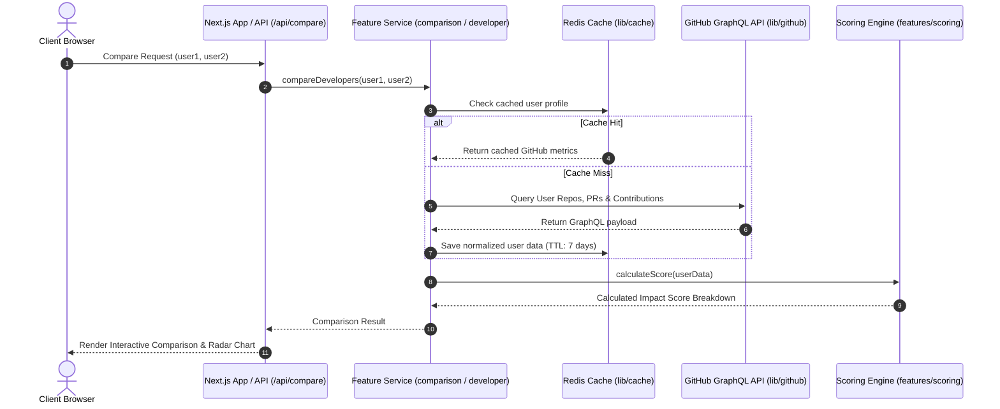
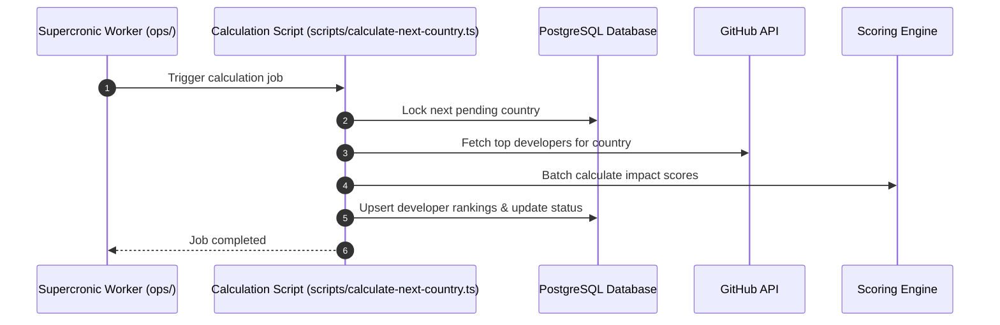

# 🏛️ DevImpact Architecture Guide

Welcome to the **DevImpact** architecture documentation. This document is designed for contributors, maintainers, and developers looking to understand the system design, directory structure, module boundaries, and implementation patterns of DevImpact.

---

## 📑 Table of Contents

1. [Architectural Overview & Philosophy](#-architectural-overview--philosophy)
2. [System Topology & Data Flow](#-system-topology--data-flow)
3. [Repository Directory Structure](#-repository-directory-structure)
4. [The Feature-Driven Architecture Pattern](#-the-feature-driven-architecture-pattern)
5. [Core Features Breakdown](#-core-features-breakdown)
6. [Shared Libraries & Infrastructure (`src/lib`)](#-shared-libraries--infrastructure-srclib)
7. [App Router & Presentation Layer (`src/app` & `src/components`)](#-app-router--presentation-layer)
8. [Cross-Cutting Concerns](#-cross-cutting-concerns)
9. [Architecture Rules & Import Boundaries](#-architecture-rules--import-boundaries)
10. [Step-by-Step Contributor Cookbooks](#-step-by-step-contributor-cookbooks)
    - [Recipe 1: Adding a New Feature](#recipe-1-adding-a-brand-new-feature)
    - [Recipe 2: Modifying an Existing Feature (e.g., Scoring Logic)](#recipe-2-modifying-an-existing-feature)
    - [Recipe 3: Adding a Shared UI Component](#recipe-3-adding-a-shared-ui-component)
    - [Recipe 4: Adding a New Language / Locale](#recipe-4-adding-a-new-language--locale)
11. [Testing & Quality Assurance Strategy](#-testing--quality-assurance-strategy)
12. [Ops, Worker & Deployment Architecture](#-ops-worker--deployment-architecture)

---

## 🌟 Architectural Overview & Philosophy

DevImpact is an open-source platform that measures and compares software developers based on their true impact in the open-source ecosystem.

The project is architected around **Feature-Driven Scalable Next.js Architecture** (Domain-Driven Vertical Slices).

```
┌─────────────────────────────────────────────────────────────┐
│                      Next.js App Router                     │
│               (Thin Pages, Layouts, API Handlers)           │
└──────────────────────────────┬──────────────────────────────┘
                               │ delegates to
┌──────────────────────────────▼──────────────────────────────┐
│                    Feature Domain Layer                     │
│   ┌───────────────┐ ┌───────────────┐ ┌─────────────────┐   │
│   │  comparison   │ │   developer   │ │   leaderboard   │   │
│   └───────┬───────┘ └───────┬───────┘ └────────┬────────┘   │
│           │                 │                  │            │
│   ┌───────▼─────────────────▼──────────────────▼────────┐   │
│   │                   scoring engine                    │   │
│   └─────────────────────────┬───────────────────────────┘   │
└─────────────────────────────┼───────────────────────────────┘
                              │ uses
┌─────────────────────────────▼───────────────────────────────┐
│               Shared Infrastructure Layer (lib)             │
│  github client │ cache (redis) │ db (postgres) │ geo │ i18n │
└─────────────────────────────────────────────────────────────┘
```

### Core Design Principles:

1. **Feature Isolation & High Cohesion**: Code that changes together stays together. Components, services, types, and unit tests for a specific domain (e.g., developer profile or leaderboard) live within `src/features/<feature-name>`.
2. **Thin Routing Layer**: Next.js App Router files (`src/app/**`) act strictly as thin controllers—handling routing, search params, SEO metadata, and delegating business logic to feature services and feature components.
3. **Resilience & Graceful Degradation**: Core developer comparison functions even if caching (Redis) or the persistent database (PostgreSQL) is offline or undergoing maintenance.
4. **First-Class Internationalization**: Bidirectional (RTL/LTR) support and multi-language translations (English & Arabic) are baked into components and layout structures.
5. **Strict Testability**: Business logic is isolated from React rendering lifecycles, enabling rapid and comprehensive testing using Vitest without mocking browser DOMs when testing pure algorithms.

---

## 🔄 System Topology & Data Flow

### 1. Developer Comparison & Profile Flow (Real-Time Read-Through)



### 2. Leaderboard Calculation Pipeline (Asynchronous Background Worker)



---

## 📁 Repository Directory Structure

```
DevImpact/
├── ops/                     # Infrastructure, Dockerfiles, Cron & Deployment scripts
│   ├── cron/                # Supercronic job definitions
│   ├── deploy/              # VPS automated deployment scripts
│   └── docker/              # Dockerfiles for Web App and Worker + Compose files
├── public/                  # Static assets, flags, screenshots, fonts
├── scripts/                 # CLI utilities (DB migration, leaderboard worker, locale check)
│   ├── calculate-next-country.ts
│   ├── init-db.ts
│   └── validate-locales.js
├── src/                     # Application Source Code
│   ├── app/                 # Next.js App Router (Pages, Layouts, API Routes)
│   ├── components/          # Shared, domain-agnostic UI components & Layouts
│   │   ├── layout/          # Navbar, Footer, Mobile Navigation, Theme/Lang Switchers
│   │   ├── providers/       # ThemeProvider, LocaleProvider, Client-side contexts
│   │   ├── seo/             # StructuredData, OpenGraph metadata wrappers
│   │   └── ui/              # Reusable primitives (buttons, inputs, cards, dialogs)
│   ├── data/                # Static lookup data (e.g., countries list, ISO codes)
│   ├── features/            # Feature-Driven Domain Modules
│   │   ├── comparison/      # Developer comparison logic & UI
│   │   ├── developer/       # Developer profile, PR metrics, repository stats
│   │   ├── leaderboard/     # Country rankings, grids, and filters
│   │   └── scoring/         # Scoring algorithms, formulas, language weightings
│   ├── lib/                 # Shared infrastructure adapters & clients
│   │   ├── cache/           # Redis client & read-through cache manager
│   │   ├── db/              # PostgreSQL connection pool & queries
│   │   ├── geo/             # Country normalization, flags, slugification
│   │   ├── github/          # Octokit GraphQL client & query builders
│   │   ├── i18n/            # Localization engine, cookies, dictionary loader
│   │   ├── logger/          # Structured logging utility
│   │   └── seo/             # Dynamic metadata & OpenGraph generators
│   ├── locales/             # i18n translation dictionaries
│   │   ├── ar.json          # Arabic translations (RTL)
│   │   └── en.json          # English translations (LTR)
│   ├── middleware.ts        # Next.js middleware (locale detection & routing)
│   ├── types/               # Global TypeScript definitions
│   └── utils/               # Low-level helpers (e.g., cn Tailwind utility)
├── .env.example             # Template for required environment variables
├── next.config.js           # Next.js configuration
├── tailwind.config.ts       # Tailwind CSS theme & plugin configuration
├── tsconfig.json            # TypeScript path aliases configuration
└── vitest.config.ts         # Vitest unit & integration test configuration
```

---

## 🧩 The Feature-Driven Architecture Pattern

Every feature inside `src/features/<feature-name>` follows a standardized, modular anatomy:

```
src/features/<feature-name>/
├── components/              # UI components exclusive to this feature
│   ├── feature-view.tsx
│   └── feature-card.tsx
├── services/                # Pure business logic, calculations, data transformations
│   └── feature-service.ts
├── tests/                   # Colocated unit and integration tests (Vitest)
│   ├── feature-service.test.ts
│   └── feature.route.test.ts
├── types.ts                 # Domain-specific TypeScript models and interfaces
└── index.ts                 # Public API / Barrel export (encapsulation boundary)
```

### Why This Structure?

- **Encapsulation**: Internal implementation details of a feature are hidden behind `index.ts`.
- **Easy Deletion/Refactoring**: If a feature is removed or rewritten, all associated code (UI, tests, types, business logic) is in one place.
- **Clear Ownership**: Contributors can easily identify which files to edit for a specific functionality.

---

## 🔍 Core Features Breakdown

### 1. `comparison` (`src/features/comparison`)

- **Responsibility**: Manages side-by-side comparison between two developers.
- **Key Components**:
  - `CompareForm`: User inputs with validation and language filter selector.
  - `ComparisonClient`: Interactive side-by-side metrics, score differential badges, and radar charts.
- **Key Services**:
  - `compare-service.ts`: Orchestrates fetching user records, executing scoring calculations, and determining metric winners.
- **Types**: `ComparisonResult`, `CompareRequest`, `ComparisonWinner`.

### 2. `developer` (`src/features/developer`)

- **Responsibility**: Inspects a single GitHub developer's profile.
- **Key Components**:
  - `UserProfileClient`: Full profile view showing developer avatar, bio, location, impact breakdown, and stats.
  - `PullRequestMetrics`: Breakdown of external PRs, additions/deletions, and target repo quality.
  - `TopRepositories`: Visual display of owned repositories and star/fork impact.
- **Key Services**:
  - `developer-service.ts`: Fetches and normalizes raw GitHub profile metrics.
- **Types**: `DeveloperProfile`, `PullRequestMetric`, `RepositoryMetric`.

### 3. `leaderboard` (`src/features/leaderboard`)

- **Responsibility**: Handles country developer rankings and country discovery.
- **Key Components**:
  - `CountryGridClient`: Responsive grid of countries with search, developer counts, and flags.
  - `LeaderboardClient`: Ranked developer table with pagination, score meters, and medal indicators.
- **Key Services**:
  - `leaderboard-service.ts`: Queries PostgreSQL database with fallback and caching.
- **Types**: `CountryLeaderboardEntry`, `LeaderboardFilters`.

### 4. `scoring` (`src/features/scoring`)

- **Responsibility**: The core mathematical engine that evaluates developers.
- **Key Components**:
  - `ScoringMethodologyClient`: Interactive educational breakdown of scoring formulas and logarithmic curves.
- **Key Services**:
  - `score-engine.ts`: Core algorithm combining Repo Score, PR Score, and Contribution Score.
  - `repo-scoring.ts`: Star, fork, and watcher scoring with top-5 logarithmic weighting.
  - `pr-scoring.ts`: External merged PR scoring with repository popularity and size factors.
  - `contribution-scoring.ts`: Issue and discussion scoring (excluding duplicate PRs/commits).
  - `language-scoring.ts`: Language-specific weighting and filtering.
- **Types**: `ScoreBreakdown`, `ScoringWeights`, `LanguageScore`.

---

## 🛠️ Shared Libraries & Infrastructure (`src/lib`)

The `src/lib/` directory contains infrastructure adapters and cross-domain utilities:

| Module       | Location          | Purpose                                                                                                         |
| :----------- | :---------------- | :-------------------------------------------------------------------------------------------------------------- |
| **Cache**    | `src/lib/cache/`  | Redis client with connection pooling, read-through caching, TTL management, and single-flight request handling. |
| **Database** | `src/lib/db/`     | PostgreSQL client pool (`pg`), query helpers, and automated schema migration verification.                      |
| **Geo**      | `src/lib/geo/`    | Country name normalization, slug translation, and flag asset resolution.                                        |
| **GitHub**   | `src/lib/github/` | Octokit GraphQL client with rate-limit monitoring, query batching, and schema typing.                           |
| **i18n**     | `src/lib/i18n/`   | Localization context, dictionary loader (`en.json`, `ar.json`), language switcher cookies, and RTL detection.   |
| **Logger**   | `src/lib/logger/` | Structured JSON logging for request tracking, cache performance, and error analysis.                            |
| **SEO**      | `src/lib/seo/`    | Metadata generator functions for dynamic page titles, OpenGraph images, and canonical URLs.                     |

---

## 🖥️ App Router & Presentation Layer

### Next.js Pages & Routing (`src/app`)

Next.js App Router routes act as thin presentation wrappers:

```
src/app/
├── (routes)
│   ├── page.tsx                           # Home / Comparison page
│   ├── user/[username]/page.tsx           # Developer profile page
│   ├── leaderboard/
│   │   ├── page.tsx                       # Country grid discovery
│   │   └── [country]/page.tsx             # Specific country leaderboard
│   └── scoring-methodology/page.tsx       # Scoring explanation & formulas
├── api/
│   ├── compare/route.ts                   # POST / GET comparison API
│   ├── user/[username]/route.ts           # Developer profile API
│   └── leaderboard/route.ts               # Country rankings API
├── layout.tsx                             # Root layout (Fonts, Providers, Navbar, Footer)
└── providers.tsx                          # Theme & Locale client wrapper
```

### Shared UI Components (`src/components`)

- **`src/components/ui/`**: Generic, domain-agnostic UI building blocks (Button, Input, Card, Badge, Skeleton, Dialog, Tooltip, Table).
- **`src/components/layout/`**: Structural chrome components (Navbar, Footer, Language Switcher, Theme Switcher, Mobile Navigation Drawer).
- **`src/components/providers/`**: Context providers (NextThemesProvider, I18nProvider).
- **`src/components/seo/`**: JSON-LD Structured Data components and OpenGraph meta builders.

---

## 🌐 Cross-Cutting Concerns

### 1. Internationalization (i18n) & RTL Support

DevImpact supports **English (LTR)** and **Arabic (RTL)**.

- Dictionaries live in `src/locales/en.json` and `src/locales/ar.json`.
- In components, consume translations via the `useTranslations` hook:
  ```tsx
  import { useTranslations } from "@/lib/i18n";

  export function MyComponent() {
    const { t, locale, isRTL } = useTranslations();
    return <h1>{t("home.title")}</h1>;
  }
  ```
- **Validation**: Whenever you modify or add translation keys, run:
  ```bash
  pnpm validate-locales
  ```

### 2. Theming (Dark & Light Mode)

Theming is managed via `next-themes` and Tailwind CSS `dark:` variant classes:

- Always use semantic color tokens defined in `src/app/globals.css` and `tailwind.config.ts` (`bg-background`, `text-foreground`, `bg-card`, `border-border`).
- Avoid hardcoding static colors (e.g., `#ffffff` or `text-black`).

---

## 📐 Architecture Rules & Import Boundaries

To keep the codebase maintainable as it grows, follow these rules:

### 1. Path Aliases

Always use the configured path aliases instead of relative `../../` imports:

```typescript
// ✅ Good
import { calculateUserScore } from "@/features/scoring";
import { getRedisClient } from "@/lib/cache";
import { Button } from "@/components/ui";
import type { ApiResponse } from "@/types";

// ❌ Bad
import { calculateUserScore } from "../../../features/scoring/services/score-engine";
import { getRedisClient } from "../../lib/cache/redis";
```

### 2. Feature Encapsulation

- Import other features **only** through their public barrel file (`@/features/<feature-name>`).
- **Never** import internal private files of another feature directly.

### 3. Server vs. Client Components

- Keep data fetching, database queries, and GitHub API calls on the **Server** (Server Components, Server Actions, or API Routes in `src/app/api/`).
- Use `'use client'` strictly for components that require React hooks (`useState`, `useEffect`), browser events, or animation libraries.

---

## 📖 Step-by-Step Contributor Cookbooks

### Recipe 1: Adding a Brand New Feature

Let's say you want to add an **Organizations** feature (`src/features/organizations/`):

#### Step 1: Create the Feature Directory Structure

```bash
mkdir -p src/features/organizations/components
mkdir -p src/features/organizations/services
mkdir -p src/features/organizations/tests
```

#### Step 2: Define Domain Types (`src/features/organizations/types.ts`)

```typescript
export interface OrganizationMetric {
  name: string;
  avatarUrl: string;
  totalMembers: number;
  totalRepos: number;
  aggregatedScore: number;
}
```

#### Step 3: Implement Business Logic (`src/features/organizations/services/org-service.ts`)

```typescript
import { queryGitHubOrg } from "@/lib/github";
import { calculateRepoScore } from "@/features/scoring";
import type { OrganizationMetric } from "../types";

export async function getOrganizationImpact(orgName: string): Promise<OrganizationMetric> {
  const rawData = await queryGitHubOrg(orgName);
  // Perform calculations using shared features
  return {
    name: orgName,
    avatarUrl: rawData.avatarUrl,
    totalMembers: rawData.membersCount,
    totalRepos: rawData.repositories.length,
    aggregatedScore: 100, // your calculation
  };
}
```

#### Step 4: Create UI Components (`src/features/organizations/components/org-card.tsx`)

```tsx
import { OrganizationMetric } from "../types";
import { Card, CardHeader, CardTitle, CardContent } from "@/components/ui";

export function OrganizationCard({ org }: { org: OrganizationMetric }) {
  return (
    <Card>
      <CardHeader>
        <CardTitle>{org.name}</CardTitle>
      </CardHeader>
      <CardContent>
        <p>Impact Score: {org.aggregatedScore}</p>
      </CardContent>
    </Card>
  );
}
```

#### Step 5: Export Public Surface (`src/features/organizations/index.ts`)

```typescript
export * from "./types";
export * from "./services/org-service";
export * from "./components/org-card";
```

#### Step 6: Write Unit Tests (`src/features/organizations/tests/org-service.test.ts`)

```typescript
import { describe, it, expect } from "vitest";
import { getOrganizationImpact } from "../services/org-service";

describe("Organization Service", () => {
  it("should calculate organization impact correctly", async () => {
    // test logic
  });
});
```

#### Step 7: Mount in Next.js App Router (`src/app/org/[slug]/page.tsx`)

```tsx
import { getOrganizationImpact, OrganizationCard } from "@/features/organizations";

export default async function OrgPage({ params }: { params: Promise<{ slug: string }> }) {
  const { slug } = await params;
  const orgData = await getOrganizationImpact(slug);
  return <OrganizationCard org={orgData} />;
}
```

---

### Recipe 2: Modifying an Existing Feature

#### Example: Modifying the Scoring Algorithm

1. Open the scoring service file: `src/features/scoring/services/score-engine.ts` (or `pr-scoring.ts`, `repo-scoring.ts`).
2. Update the calculation logic or weight constant.
3. If new metrics are added, update `src/features/scoring/types.ts`.
4. Run tests to verify existing invariants:
   ```bash
   pnpm test src/features/scoring
   ```
5. Update or add test cases in `src/features/scoring/tests/` to reflect new scoring behavior.

---

### Recipe 3: Adding a Shared UI Component

If a UI component is **domain-agnostic** (e.g., a Progress Bar, Tooltip, or Modal) and can be used across multiple features:

1. Create the component in `src/components/ui/progress-bar.tsx`.
2. Export it from `src/components/ui/index.ts` (and `src/components/index.ts`).
3. Use Tailwind CSS variables and semantic classes for dark/light mode compatibility.

---

### Recipe 4: Adding a New Language / Locale

1. Create a new dictionary file: `src/locales/<lang-code>.json` (e.g., `src/locales/fr.json`).
2. Copy the key structure from `src/locales/en.json` and translate the values.
3. Update `src/lib/i18n/config.ts` to register the new supported locale and its text direction (`ltr` or `rtl`).
4. Validate translation integrity:
   ```bash
   pnpm validate-locales
   ```

---

## 🧪 Testing & Quality Assurance Strategy

We use **Vitest** for fast, reliable unit and integration testing.

### Running Tests

```bash
# Run all tests once
pnpm test

# Run tests in watch mode during development
pnpm test:watch

# Run a specific feature test suite
npx vitest run src/features/developer
```

### Pre-Commit Checklist

Before opening a pull request, ensure all checks pass:

```bash
# 1. Run unit & integration tests
pnpm test

# 2. Check TypeScript types
npx tsc --noEmit

# 3. Validate localization keys
pnpm validate-locales

# 4. Check linting and formatting
pnpm lint
pnpm format:check

# 5. Verify production build
pnpm build
```

---

## 🚢 Ops, Worker & Deployment Architecture

### Background Worker Service (`ops/`)

The Leaderboard calculation runs asynchronously via a standalone Docker container using **Supercronic**:

- **Cron Schedule**: Defined in `ops/cron/leaderboard.cron`.
- **Worker Dockerfile**: `ops/docker/Dockerfile.worker`.
- **Execution Script**: `scripts/calculate-next-country.ts`.

For complete documentation on running Docker Compose locally, GHCR image publishing, and VPS deployments, refer to **[ops/README.md](ops/README.md)**.

---

## 🤝 Questions & Getting Help

If you have questions about the architecture or need guidance on implementing a new capability:

- Check existing issues or open a new discussion on [GitHub Issues](https://github.com/O2sa/DevImpact/issues).
- Review [CONTRIBUTING.md](CONTRIBUTING.md) for contribution workflows and PR guidelines.
